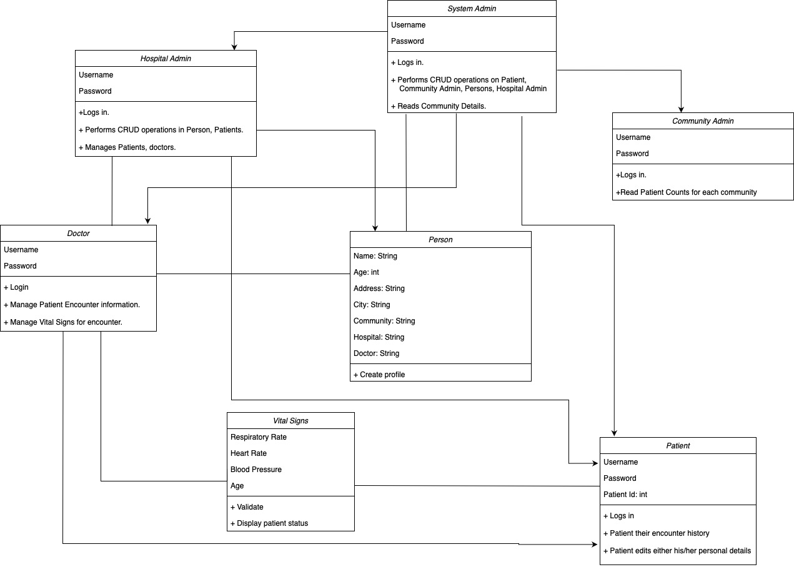

# Hospital Management System.

Created a java-swing based Health Management Portal for assignment (INFO-1500)
The scope of the assignment is :
1. For people to find hospitals in their community
2. To perform CRUD operations on person, patient, community and their encounters
3. For doctors to add encounter and change Vital Signs of the patients
4. For the Community Admins to change information realated to the community
5. For the System Admin to perform CRUD operations on all the other admins

 

  
  

## Required Tools

Netbeans, java developer kit

## NUID : 002764127
